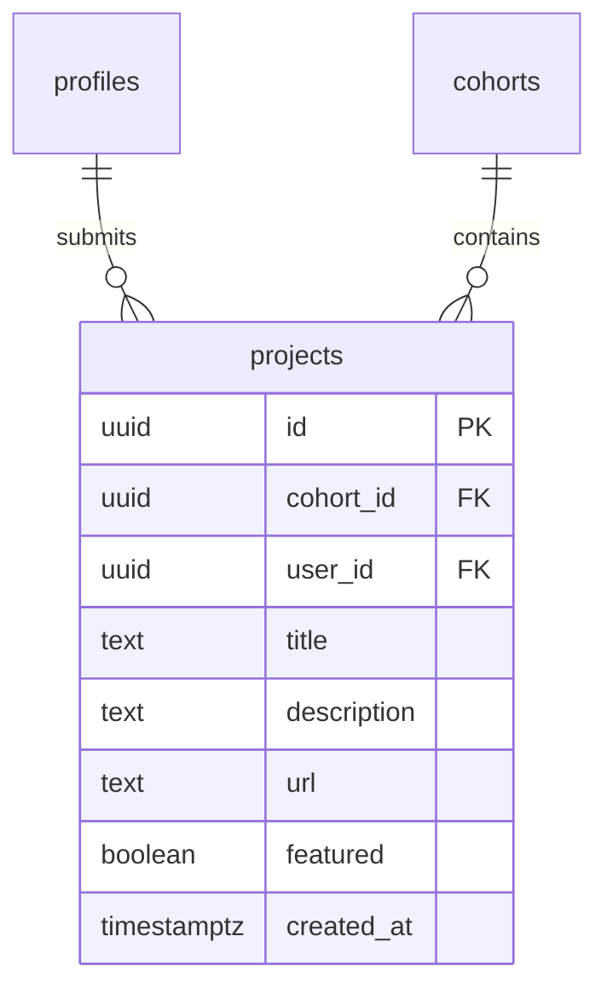

# feat: Project Showcase — Builds Tab on Cohort Dashboard

## Overview

Add a **Builds** tab to the cohort members area where enrolled students can submit the project they're working on and see what their peers are building. This is the highest-leverage, lowest-complexity move to make the Techne platform feel like a community rather than just a content library.

Community and accountability already live in Discord/Zoom. This feature makes the *permanent, visible record of what people built* live on the platform.

## Problem Statement

The platform is a payment system + content library. The "wow, look what I built" moment — the social proof that creates peer inspiration and self-directed momentum — has nowhere to live. It happens in Discord (ephemeral) or doesn't happen at all. This feature gives it a home.

## Proposed Solution

A new `projects` table and a **Builds** tab on `/cohort?tab=projects` that:
- Lets students submit their project (title, URL, description)
- Shows a grid of all cohort builds with links out to live projects
- Lets admins feature standout projects (highlighted at top)
- Lets students edit or delete their own submission

No file uploads, no comments, no reactions. Just builds.

---

## Architecture Decision Record

**Screenshots:** URL-only in Phase 1. No Supabase Storage needed. Students paste a live URL; the card links out. Adding a screenshot upload would require net-new storage bucket + RLS + upload UI — defer to Phase 2.

**One project per student per cohort:** Yes, via a unique constraint. Students iterate on one thing; this isn't a portfolio of everything. They can update it freely.

**Visibility:** Enrolled students in the same cohort only. Projects are not public until a future "public showcase" phase tied to the `/programs` page.

**Featured flag:** Boolean, admin-only toggle. Featured projects render first in the grid.

---

## ERD



---

## Files to Create / Modify

### New Files
- `supabase/migrations/005_project_showcase.sql`
- `app/cohort/_components/ProjectSubmitForm.tsx`
- `app/admin/_components/ProjectAdminTable.tsx`

### Modified Files
- `app/cohort/page.tsx` — add projects query + Builds tab UI
- `app/admin/_components/AdminDashboard.tsx` — add Projects tab
- `app/globals.css` — add `.project-card`, `.projects-grid`

---

## Implementation Plan

### Step 1: Migration (`005_project_showcase.sql`)

```sql
-- Techne Institute V1 — Project Showcase

create table public.projects (
  id          uuid primary key default gen_random_uuid(),
  cohort_id   uuid not null references public.cohorts on delete cascade,
  user_id     uuid not null references auth.users on delete cascade,
  title       text not null,
  description text,
  url         text,
  featured    boolean not null default false,
  created_at  timestamptz not null default now(),
  -- One project per student per cohort
  unique (cohort_id, user_id)
);

alter table public.projects enable row level security;

-- Enrolled students can read all projects in their cohort
create policy "projects: enrolled students read"
  on public.projects for select
  using (
    exists (
      select 1 from public.enrollments e
      where e.user_id = auth.uid()
        and e.cohort_id = projects.cohort_id
    )
  );

-- Students can insert their own project
create policy "projects: students insert own"
  on public.projects for insert
  with check (auth.uid() = user_id);

-- Students can update their own project (but not featured flag)
create policy "projects: students update own"
  on public.projects for update
  using (auth.uid() = user_id)
  with check (
    auth.uid() = user_id
    and featured = (select featured from public.projects where id = projects.id)
  );

-- Students can delete their own project
create policy "projects: students delete own"
  on public.projects for delete
  using (auth.uid() = user_id);

-- Admins can do everything
create policy "projects: admins all"
  on public.projects for all
  using (
    exists (
      select 1 from public.profiles p
      where p.id = auth.uid() and p.is_admin = true
    )
  );

-- Indexes
create index idx_projects_cohort_id on public.projects (cohort_id);
create index idx_projects_user_id   on public.projects (user_id);
create index idx_projects_cohort_featured on public.projects (cohort_id, featured desc, created_at desc);
```

### Step 2: Cohort Page (`app/cohort/page.tsx`)

Add to the parallel `Promise.all` fetch:
```ts
// Existing:
supabase.from('sessions').select(...)
supabase.from('resources').select(...)
supabase.from('enrollments').select('profiles!inner(display_name)')...

// Add:
supabase
  .from('projects')
  .select('id, user_id, title, description, url, featured, created_at, profiles(display_name)')
  .eq('cohort_id', cohort.id)
  .order('featured', { ascending: false })
  .order('created_at', { ascending: false })
```

Add `Builds` tab link (follows existing `?tab=` URL pattern):
```tsx
<Link href="/cohort?tab=projects" className={`cohort-tab${tab === 'projects' ? ' active' : ''}`}>
  Builds ({projects.length})
</Link>
```

Add Builds tab content section (after existing sessions/resources/directory sections):
```tsx
{tab === 'projects' && (
  <div>
    <ProjectSubmitForm cohortId={cohort.id} existingProject={myProject} />
    {projects.length === 0 ? (
      <div className="empty-state"><p>No builds submitted yet. Add yours above.</p></div>
    ) : (
      <div className="projects-grid">
        {featured first, then rest...}
        {projects.map(p => <ProjectCard key={p.id} project={p} />)}
      </div>
    )}
  </div>
)}
```

Note: `myProject` = `projects.find(p => p.user_id === user.id) ?? null` — passed to the form so it pre-fills for edits.

### Step 3: Submit Form (`app/cohort/_components/ProjectSubmitForm.tsx`)

`'use client'` component. Uses browser `createClient()`. Pattern matches `SessionForm.tsx` exactly.

```tsx
'use client'
// State: title, url, description, loading, error, success
// On submit: upsert (insert or update own project via unique constraint)
//   await supabase.from('projects').upsert({ cohort_id, user_id, title, url, description })
//   router.refresh()
// On delete: supabase.from('projects').delete().eq('id', existingProject.id)
//   router.refresh()
```

Fields:
- `title` — text input, required, placeholder "What did you build?"
- `url` — url input, optional, placeholder "https://..."
- `description` — textarea, optional, placeholder "One or two sentences about it."
- Submit: "Share Build" / "Update Build"
- Delete: small "Remove" link if `existingProject` exists

### Step 4: Admin Projects Tab (`app/admin/_components/ProjectAdminTable.tsx`)

`'use client'` component. Receives `projects` as prop (pre-fetched server-side in `app/admin/page.tsx`).

Table columns: Student | Title | URL | Featured | Submitted
- Featured column: toggle button — calls `supabase.from('projects').update({ featured: !p.featured }).eq('id', p.id)` then `router.refresh()`
- URL column: renders via `safeHostname(p.url)` (already exists in `AdminDashboard.tsx`)

Add to `AdminDashboard.tsx` tab buttons:
```tsx
<button className={`cohort-tab${tab === 'projects' ? ' active' : ''}`} onClick={() => setTab('projects')}>
  Projects ({cohortProjects.length})
</button>
```

Admin page server fetch adds:
```ts
supabase
  .from('projects')
  .select('id, cohort_id, user_id, title, url, description, featured, created_at, profiles(display_name)')
  .order('created_at', { ascending: false })
```

### Step 5: CSS (`app/globals.css`)

Add after the `/* ============ PROGRAMS PAGE ============ */` section:

```css
/* ============ PROJECT SHOWCASE ============ */
.projects-grid {
  display: grid;
  grid-template-columns: repeat(auto-fill, minmax(280px, 1fr));
  gap: 1.5rem;
  margin-top: 2rem;
}

.project-card {
  padding: 1.75rem;
  background: var(--cream);
  border-bottom: 2px solid var(--bone);
  transition: border-color 0.3s ease;
  position: relative;
}

.project-card:hover { border-color: var(--ember); }

.project-card.featured {
  border-bottom-color: var(--ember);
  background: linear-gradient(135deg, rgba(194,81,42,0.04) 0%, var(--cream) 100%);
}

.project-card-meta {
  font-family: var(--font-mono);
  font-size: 0.6rem;
  letter-spacing: 0.1em;
  text-transform: uppercase;
  color: var(--stone);
  margin-bottom: 0.5rem;
}

.project-card h4 {
  font-family: var(--font-display);
  font-size: 1.2rem;
  font-weight: 500;
  color: var(--charcoal);
  margin-bottom: 0.5rem;
}

.project-card p {
  font-size: 0.875rem;
  color: var(--graphite);
  margin: 0 0 1rem;
}

.project-card a.project-link {
  font-family: var(--font-mono);
  font-size: 0.65rem;
  color: var(--ember);
  text-decoration: none;
  letter-spacing: 0.05em;
}

.project-card a.project-link:hover { text-decoration: underline; }
```

---

## Acceptance Criteria

- [ ] Migration `005_project_showcase.sql` runs cleanly via `supabase db push`
- [ ] Enrolled student can submit a project (title required, URL + description optional)
- [ ] Submitting again updates the existing project (upsert — one per student per cohort)
- [ ] Student can delete their own project
- [ ] All cohort members can see the builds grid on `/cohort?tab=projects`
- [ ] Featured projects appear first in the grid
- [ ] Admin can see all projects in the admin Projects tab
- [ ] Admin can toggle `featured` on any project
- [ ] Non-enrolled users cannot read or write projects (RLS enforced)
- [ ] Students cannot change the `featured` flag on their own project (RLS `with check`)
- [ ] Empty state shown when no projects submitted yet
- [ ] Build count shown in tab label

## Out of Scope (Phase 2)

- Screenshot / image upload (requires Supabase Storage)
- Public showcase page linked from `/programs`
- Comments or reactions on projects
- Multiple projects per student

---

## References

- Brainstorm: `docs/brainstorms/2026-02-24-techne-growth-brainstorm.md`
- Existing tab pattern: `app/cohort/page.tsx:113-131`
- Existing form pattern: `app/admin/_components/SessionForm.tsx`
- Existing admin toggle pattern: `app/admin/_components/SessionForm.tsx:148-158`
- CSS card patterns: `app/globals.css:1458-1487` (`.cohort-card`)
- RLS pattern: `supabase/migrations/002_rls_policies.sql`
- `safeHostname` helper: `app/admin/_components/AdminDashboard.tsx:26-32`
